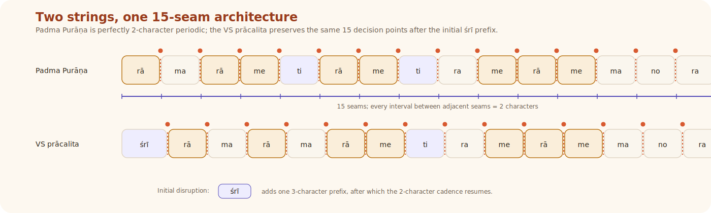
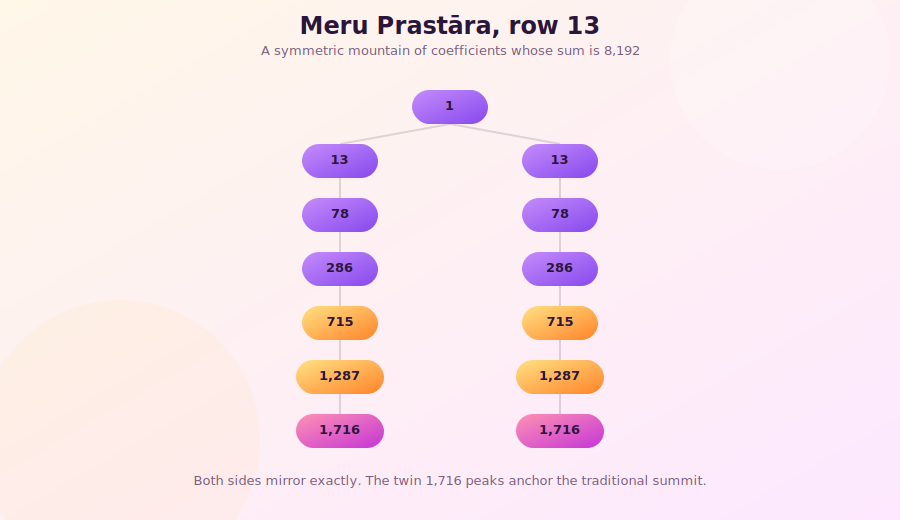
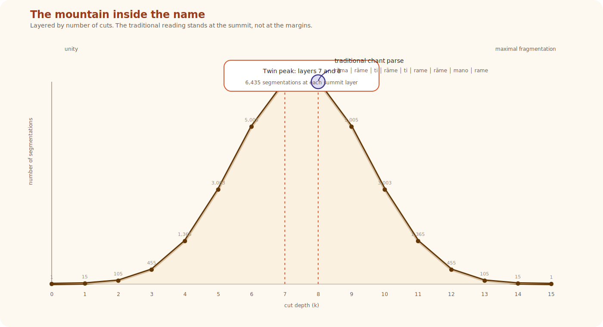
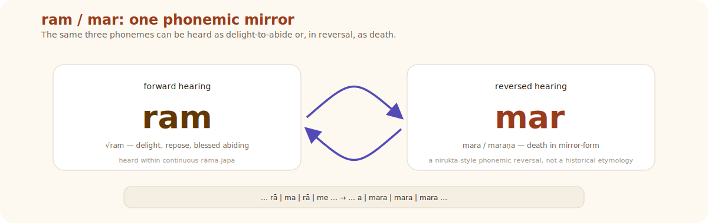
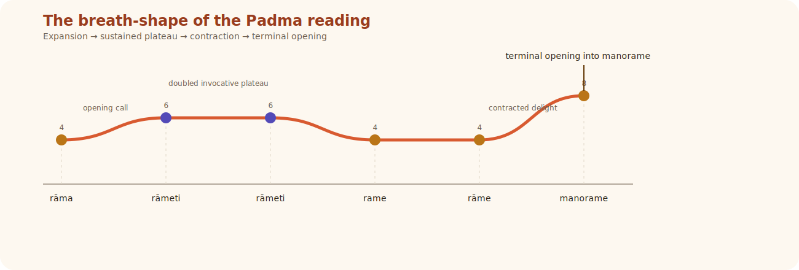
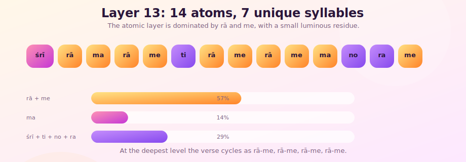

# śrīrāma rāmeti rāme rāme manorame

## What Hides Inside the Name We Chant

### oṃ

Among the avatāras of Viṣṇu, Śrī Rāma stands in a distinct radiance. Kṛṣṇa dazzles, Narasiṃha erupts, Vāmana astonishes, but Rāma is remembered in another way: as *maryādā puruṣottama*, the fullness of divine order embodied in human form. In him, dharma does not descend as spectacle alone. It walks, speaks, suffers, chooses, restrains itself, and remains luminous without ceasing to be tender. That is why the name "Rāma" is not merely the name of a king in an epic, nor merely the name of one avatāra among others. For countless Hindus it is the felt presence of divinity itself made utterable. The name does not merely point toward the Lord from afar. The name is already warm with him.

It is therefore no small thing that Lord Śiva himself should speak of this name with such intimacy. The tradition has preserved the verse for centuries, and not as an abstract statement, but as something lived in homes, temples, journeys, grief, and relief:

> *śrīrāma rāmeti rāme rāme manorame*
> *sahasranāma tattulyaṃ rāmanāma varānane*

Śiva says it to Pārvatī in the Uttara-Khaṇḍa of the Padma Purāṇa. Bhīṣma repeats it in the phala-śruti of the Viṣṇu Sahasranāma, speaking to Yudhiṣṭhira on his bed of arrows. Devotees repeat it because they trust it. The claim is simple and immense: the name of Rāma is equal to the thousand names. One name, and yet not one name only. One utterance, and yet a fullness capable of bearing what the Sahasranāma unfolds across its vast garland of names.

For most devotees, that is enough. Śiva has spoken; devotion rests there. But devotion also has its own hunger. Love does not merely repeat. Love also looks, listens, turns the jewel in the light, and asks with wonder: what did Śiva see here? If the thousand names can be gathered into this one current of sound, how does that gathering happen? What lies hidden in these syllables that allows the tradition to say, without hesitation, that the name of Rāma stands equal to the Sahasranāma?

What follows is written in that spirit. It is not an attempt to diminish the mantra by over-analysis, nor to subject it to an alien method. It is an offering of attention. The tools are drawn from within the Sanskritic world itself: counting, grammar, phonetics, nirukta, and the contemplative instinct that has always known that sacred sound carries more than surface meaning. The purpose is devotion. The mood is wonder. The hope is that what devotees have long known in their mouths may become, for a moment, visible to the mind.

---

## The String

Every layered reading in this essay begins from one disciplined decision: nothing will be imported until the line itself is first allowed to speak. Remove the spaces. Write the first line continuously in Devanāgarī:

> श्रीरामरामेतिरामेरामेमनोरमे

Now transliterate it into Roman letters and number the positions:

```text
ś  r  ī  r  ā  m  a  r  ā  m  e  t  i  r  ā  m  e  r  ā  m  e  m  a  n  o  r  a  m  e
0  1  2  3  4  5  6  7  8  9  10 11 12 13 14 15 16 17 18 19 20 21 22 23 24 25 26 27 28
```

Twenty-nine phonemic units in Roman transliteration. Everything that follows comes from this string and nothing else.



Three operations are used throughout. The first is formal: all admissible boundary placements under a fixed segmentation rule are counted. This yields exact numbers. The second is grammatical: specific segmentations are interpreted through Sanskrit morphology and the vyākaraṇa tradition. This yields constrained meanings. The third is nirukta-devotional: substrings, reversals, bīja readings, and contemplative extensions are explored through the wider Sanskrit hermeneutic tradition. This yields insight rather than proof. The three operations are distinct. Their distinction matters. The appendix at the end classifies every finding by which operation produced it, so that the reader always knows what kind of ground they are standing on.

---

## The Mountain

### Where the Boundaries Can Fall

The first secret of the verse is not semantic but structural. In Sanskrit, a word-boundary can fall where a vowel is followed by a consonant. In this string that happens thirteen times: after positions 2, 4, 6, 8, 10, 12, 14, 16, 18, 20, 22, 24, and 26.

At each of these thirteen points, there is a binary choice. Cut or do not cut. Yes or no. Split or leave whole. Two options at each point. That alone gives the formal count:

2^13 = 8,192.

The mathematics here is exact. Thirteen candidate boundaries, all subsets counted, yields 8,192 possible segmentations.

But the structure has a second beauty. The spacing between adjacent candidate boundaries is uniformly two characters. Between position 2 and 4 lies *rā*. Between 4 and 6 lies *ma*. Then *me, ti, rā, me, rā, me, ma, no, ra, me*. The count itself does not require these pieces to be meaningful. But the verse goes further than mere countability. The minimum units created by the spacing are not dead fragments. They are interpretable Sanskrit syllabic units: some, like rā, ma, and ra, have strong standing as bījas in the esoteric tradition; others, like me, ti, and no, are meaningful as grammatical particles (dative pronoun, verbal suffix, enclitic pronoun). That means the line is not only divisible. It remains alive under division.

This is why the Rāma verse is unusual, and to see how unusual, it helps to compare. Other Sanskrit verses have vowel-consonant split-points too. In the Viṣṇu Sahasranāma's verse 14 (*viśvaṃ viṣṇur vaṣaṭkāro...*), with 88 characters and 55 potential split-points, the pure formal counting rule yields 2^55 raw combinations. When a linguistic filter is applied, rejecting splits that produce fragments too short to function as words, the count drops to 54.5 billion, and the distribution becomes lopsided. In the Śiva Sahasranāma's verse 150, with 71 characters and 46 split-points, the filtered count is 271.8 billion, again asymmetric. In those verses, the formal and the filtered counts diverge, because some split-combinations produce single-character fragments or consonant clusters that cannot stand as independent units. In this verse they converge. The uniform two-character spacing means every fragment is at least two characters long, and the specific phonological content means each one is interpretable. Length alone does not guarantee admissibility, but in this verse the length and the content align. Among every verse tested in the corpus, only the Rāma verse has that property. The verse survives its own division. It does not shatter into debris. It opens into further possibility.

### What 8,192 Looks Like

Once grouped by the number of cuts used, the 8,192 segmentations arrange themselves into the thirteenth row of Meru Prastāra, the staircase of Mount Meru, known to Indian mathematicians through Piṅgala's *Chandaśśāstra*, one of the six Vedāṅgas, which uses exactly the same operation (binary choice at each metrical position, *guru* or *laghu*) to count verse patterns. The tool we are using to analyze this verse is the tradition's own mathematical instrument.



```text
Layer  0:       1
Layer  1:      13
Layer  2:      78
Layer  3:     286
Layer  4:     715
Layer  5:   1,287
Layer  6:   1,716   ← PEAK
Layer  7:   1,716   ← PEAK (tradition's reading)
Layer  8:   1,287
Layer  9:     715
Layer 10:     286
Layer 11:      78
Layer 12:      13
Layer 13:       1
Total:      8,192
```



The shape rises from one, climbs through expanding multiplicity, reaches a twin peak, and descends in exact reverse. This symmetry follows from the basic identity C(13, k) = C(13, 13−k). Choosing which *k* points to split is mathematically the same as choosing which *(13−k)* points to leave whole. Splitting and not-splitting mirror one another. The mountain is therefore not a metaphor imposed afterward. It is the natural form of the verse's combinatorial life.

### Where the Tradition Stands

The verse we chant in living tradition is:

> *śrīrāma rāmeti rāme rāme manorame*

For the purposes of boundary analysis, that recitational flow can be represented internally as:

> śrī │ rāma │ rāme │ ti │ rāme │ rāme │ mano │ rame

This is not the usual classroom padaccheda. The sandhied form rāmeti (rāma + iti, "thus: Rāma") is split here at the vowel-consonant junction into rāme and ti, and the compound manorame (mind-delighter) is opened into mano and rame. These are internal decompositions for boundary analysis, not conventional padaccheda in the grammatical sense. They represent the recited form opened at its internal seams so that its place in the verse's combinatorial architecture becomes visible.

And where does it stand? At Layer 7. At the summit.

This is one of the most beautiful findings in the entire essay. The tradition did not accidentally pitch its tent somewhere on the slope. It has been standing at the peak all along. Of the 1,716 possible seven-split readings at that layer, the inherited one is the reading devotion chose. The tradition reached the summit before the mountain was even drawn.

And the peak is a twin peak. Layer 6 also has 1,716 readings. The tradition explored one summit. Its mirror, with 1,716 six-split readings, has never been visited.

### The Mountain as Spiritual Arc

The mountain is not only numerical. It can also be read as a spiritual map, and what follows is a walk through all fourteen layers to show that the journey from unity through multiplicity and back to unity is not an interpretation imposed from outside but the natural form of the verse's own combinatorial architecture.

**Layer 0** is undivided sound. Zero splits. The name left whole:

> *śrīrāmarāmetirāmerāmemanorame*

One reading. One current. No visible words. This is unity before distinction. Brahman before the first vibration. There is exactly one way to leave the name whole.

**Layer 1** introduces the first cut. One became two. There are thirteen ways to make this first distinction, each creating a before and an after, observer and observed. Take the split at position 10:

> *śrīrāmarāme* │ *tirāmerāmemanorame*

"The auspicious Rāma in whom one delights" and "the one who crosses, who delights the mind." One vibration, split into two, already generating meaning.

**Layer 2** creates triadic structure. Three parts: a beginning, a middle, an end:

> *śrīrāma* │ *rāmetirāmerāme* │ *manorame*

The Named (śrīrāma). The Naming (the repetition in the middle, the act of calling). The Effect (manorame, mind-delight). The triadic structure of experience, what the tradition calls *tripuṭī*. Seventy-eight ways to configure it. The undifferentiated is already proliferating.

At **Layers 3 and 4**, names and forms emerge. At Layer 3, Lakṣmī (śrī) separates from the name for the first time. At Layer 4, recognizable words appear: śrī and rāma standing as separate units, the mind able to parse them. This is the layer of *nāma-rūpa*, the point where the undifferentiated becomes a world of distinct objects. The count is 715 and climbing.

At **Layer 5**, internal structure becomes visible. Compounds open. Grammar emerges from behind the words. The dative *me* ("to me") appears from inside a compound. The count is 1,287.

At **Layer 6**, the twin peak's mirror side, rāma itself begins to split. One instance remains whole, the name intact. Beside it, rā (giving) and me (to me) have separated. The atomic and the composite coexist in the same reading. For the first time, the generating root √rā ("to give") is visible as a standalone unit. The seed is showing through the flower. This is the summit the tradition has never stood on. 1,716 readings at this depth. None explored.

**Layer 7** is the peak described above: the tradition's reading, the point of maximum manifestation and maximum meaning-density. The One has become as many as it can become, and the number that describes "as many" is 1,716.

From here the mountain turns. What the left slope assembled, the right slope understands.

At **Layer 8**, one split past tradition, rāma reveals its components: rā (√rā, to give, to bestow) and ma (the bīja of Lakṣmī, or the particle of negation):

> *śrī* │ *rā* │ *ma* │ *rāme* │ *ti* │ *rāme* │ *rāme* │ *mano* │ *rame*

The name, divided one step further than tradition divides it, says: giving and Lakṣmī. Or: giving and not. The one who gives even negation, even *neti*, even the dissolution of attributes. This is the nirukta layer, the tradition of etymological decomposition that Yāska's Nirukta performs on Vedic words throughout. The tradition knew this operation. It was not applied systematically to this verse.

**Layers 9 through 12** continue the descent. At Layer 9, the rā-me pattern begins to dominate: giving-to-me, giving-to-me. Words are becoming syllables. The count mirrors Layer 4 exactly: 715 readings on the way up, 715 on the way down. At Layer 10, most compounds are broken; meaning is no longer lexical but vibrational. At Layer 11, only mano and rame still hold together, mind and delight fused while everything else has become bīja. There are 78 ways for this last fusion to survive, mirroring the 78 triadic readings of Layer 2. At Layer 12, thirteen readings remain, each holding one last compound, mirroring the thirteen first-cut readings of Layer 1.

And at **Layer 13**, all thirteen splits activated, the string lies in fourteen atomic pieces:

> *śrī* │ *rā* │ *ma* │ *rā* │ *me* │ *ti* │ *rā* │ *me* │ *rā* │ *me* │ *ma* │ *no* │ *ra* │ *me*

Again the count is one. But the one at the bottom is not the same as the one at the top. Layer 0 is pre-linguistic unity: the sound before the mind touches it, before analysis begins, before the first syllable-boundary is perceived. Layer 13 is post-analytic unity: the residue after analysis has exhausted every possible division and found, at the bottom, the cycling substrate of rā-me and seven irreducible seeds. One is the unity before differentiation. The other is the unity discovered through completed differentiation. Different routes. Same resting place.

In the Indian theory of speech, one may hear here an arc through parā (transcendent, undifferentiated), paśyantī (visionary, inwardly forming), madhyamā (mentally articulated), and vaikharī (outwardly spoken). The mountain traces that arc: parā at the base, vaikharī at the peak, and parā again when the analysis completes its descent. Sound becomes world. World becomes seed again.

The left slope is sṛṣṭi: the One unfolding into the many. The peak is saṃsāra: maximum manifestation, maximum nāma-rūpa. The right slope is jñāna: the many dissolving back into the One. That is the shape of the name. It is the only journey the tradition describes.

---

## The Seven Readings

The verse is not exhausted by one parse. Among the 8,192 segmentations, several are especially luminous because they yield not random phrase-pieces but coherent devotional orientations. These are not the only possible readings. They are seven especially resonant ones.

### 1. Bhakti

> śrī │ rāma │ rāmeti │ rāme │ rāme │ manorame

The reading of invocation. Five splits, Layer 5. The devotee holds "rāmeti" as the act of calling itself and "manorame" as a single vocative: O mind-delighter! The repetition *rāme rāme* intensifies interior dwelling, while *manorame* lands as the tender culmination. This is the reading closest to how the verse lives in recitation.

### 2. Jñāna

> śrī │ rāma │ rāme │ iti │ rāme │ rāme │ mano │ rame

Here *iti* becomes crucial. "Thus." The line shifts from naming into knowing. Recognition enters. Knowledge that Rāma IS delight produces delight in the knower. The *iti* marks the shift from calling to understanding.

### 3. Śākta

> śrī │ rāmā │ rāmā │ iti │ rāme │ rāme │ manorame

This goes beyond the strict formal split system and enters devotional hearing. The string's characters are fixed: the vowel at position 6 is short *a*, and no boundary-placement can lengthen it to *ā*. The characters themselves do not force *rāmā*. The reciter's orientation does. The masculine and feminine are not far apart here. The goddess is not brought from outside. She is heard through a shift of devotional attention, a reorientation toward the same sound that separates the god and the goddess by something smaller than a split-point.

### 4. Mantra

> śrī │ rā │ ma │ rā │ me │ ti │ rā │ me │ rā │ me │ ma │ no │ ra │ me

Layer 13. The lexical verse dissolves into a garland of fourteen atomic powers, each carrying its own root-meaning: rā (to give), ma (Lakṣmī), me (to me), no (to us), ra (fire). Meaning here is no longer sentence-based. It is vibrational, seed-like, mantraic.

### 5. Advaita

> śrīrāmarāmetirāmerāmemanorame

Layer 0. No cuts. No division. Name, delight, and mind remain unseparated. Only the vibration. Only the One.

### 6. Ātman

> śrī │ rāma │ rāme │ iti │ rāme │ rāme │ manorame

The locative *rāme* opens the possibility of "in Rāma" and, contemplatively, "in me." The divine delights in the devotee as the devotee delights in the divine. Interiority becomes the key. The divine is not merely praised; the divine is entered.

### 7. Līlā

> śrī │ rāma │ rāmeti │ rāme │ rāme │ mano │ rame

Here √*ram* in its sense of delighting, playing, sporting becomes decisive. *mano rame*: the mind plays. The mind is not merely instructed. It plays in the presence of the name. Creation as divine play.

These seven readings together show why the verse feels inexhaustible. It is not owned by one school. Bhakta, jñānī, Śākta, Advaitin, and mantra-upāsaka can all find their own doorway in the same stream of sound.

---

## What Hides at the Boundaries

The seven readings split the verse into words. But the boundaries are not only places where words break. They are also places where hidden possibilities flash, in the overlapping substrings that no single reading makes visible.

The densest region lies around positions 10 through 14. Three words cluster here, overlapping, all invisible in the traditional reading.

**eti (एति)**, positions 10 through 12, is the first. This is the third person singular present indicative of √i: *he approaches.* A conjugated Sanskrit verb, complete with person, number, and tense, hiding at the junction between rām*e* and *ti*rāme. The surface of the verse says "Rāma." The hidden verb says what Rāma does: he comes. The name is a sentence, and the sentence declares that the named one is in motion toward the speaker.

Overlapping with eti at positions 11 and 12 is **tirā (तिरा)**, from √tṝ, "to cross," cognate with *tīrtha* and *avatāra*. Under a nirukta-style reading, the substring suggestive of crossing sits at the crossing-point between two words. The strength of this finding is contemplative rather than strictly lexical. But that is enough for this essay. To hear crossing at the crossing-point of words is itself meaningful. The form of the extraction echoes its content. And the two hidden words overlap: the divine approaches *by crossing*.

Nearby, at positions 12 through 14 (and again at 2 through 4), is **irā (इरा)**, the Vedic word associated with refreshment, earth, speech, Sarasvatī. The goddess of speech hides within a speech-act. The mantra contains the deity who makes mantra possible.

And then there is **āme (आमे)**, across positions 8 through 10, 14 through 16, and 18 through 20. The syllable-sequence āme can be heard, under an Āyurvedic semantic lens, as recalling āma: raw, uncooked, undigested, the disease state. Whether one presses the philology hard or not, the contemplative force is clear: the sound of sickness is entangled with the sound of delight, and the fire-syllable *ra* stands beside it each time. The verse holds ailment and transformation in one body. The one who chants is sick. That is why they chant. The mantra does not pretend the sickness is absent. It holds both the disease and the cure in the same syllables, the way the sañjīvanī herb contains the remedy for the very poison it grows beside.

---

## The Name and Death

This is the devotional center of the essay.

The heart of the name Rāma is √*ram*: delight, repose, blessed abiding. Its phonemic mirror is *mar*, the root of mara, maraṇa, mṛtyu. Death. In the string, *mar* appears as a contiguous substring at every rā-**mar**-āme junction (positions 7 through 9, 13 through 15, 17 through 19). The same characters hold both name and death, differentiated only by the direction of reading.



Under the older Sanskrit habit of reversal-reading, the nirukta tradition preserved by Yāska, the inversion of a word's phonemes can disclose the nature of the thing named. Yāska's example: siṃha (lion) reversed yields hiṃsā (violence). The lion IS violence. Here the reversal of the Rāma-name reveals death in mirror-form. The method is traditional, not modern. The reading it yields is not a phonemic proof. It is what the tradition's own etymological tool produces when applied to this string.

And devotion answers with the Upaniṣadic cry:

> *mṛtyor mā amṛtaṃ gamaya*

"From death, lead me to the deathless" (Bṛhadāraṇyaka 1.3.28). The entire Kaṭha Upaniṣad is a dialogue with Mṛtyu, and what Naciketas learns from Death himself is that beyond death, by the removal of the limiting condition, is Brahman. Mṛtyu negated is a-mṛta. The deathless. Brahman.

The japa of Rāma enacts that movement physically. To say *rāma* is to utter *mara* backward. The lips and tongue that produce r-ā-m-a are producing m-a-r-a in reverse. Repetition deepens the effect. In continuous chanting, boundaries loosen. The ear begins to hear not isolated words but a stream. Then another segmentation becomes available:

> ...rāmarāmarāma...
> ...a-mara-mara-mara...

*Amara* emerges. The deathless.

This does not need to be called proof. It is better than proof. It is bodily theology. The name does not merely speak about liberation. It performs a crossing from death toward the deathless in the very medium of repetition.

This is what Śiva is telling Pārvatī. This is what Naciketas learned from Yama. The name IS the crossing from mṛtyu to amṛta, enacted in sound, executed by the body, completed by repetition.

The same region of the string yields two further reversals. **man ↔ nam** at positions 21 through 23: forward, √man (to think), the root of manas, mantra, manu; reverse, √nam (to bow), the root of namaskāra, namas. Thinking and bowing. Knowledge and surrender. The Gītā's twelfth chapter places jñāna and bhakti in equivalence. The man/nam reversal encodes this identity in three phonemes.

And **eti and the root √i** at positions 10 through 12: the hidden verb "he approaches" shares its root with *ayana* ("journey, path"). Rāmāyaṇa: the *ayana* of Rāma. Thus the name already contains the root of the epic. The Lord named in the mantra is the Lord who moves, journeys, and draws the world into his path.

---

## The Grammar of Recurrence

One of the essay's strongest layers requires neither hidden substrings nor reversal. It is visible on the surface to anyone who reads the string without preconception.

The root √*ram* returns in several grammatical forms: **rāma** (nominative, the name itself, standing full), **rāme** (locative, "in Rāma," "in delight"), **rame** (vocative or delight voiced, "O delightful one" or "I delight"), and **manorame** (compound-final, the mind transformed by delight). This is not flat repetition. The stem persists while its grammatical posture changes. The same reality returns as name, locus, address, and effect. In metaphysical language: the one appears under differing relations. In poetic language: the name comes back wearing different garments. The verse enacts in grammar what Vedānta describes in metaphysics: the one that does not change, appearing under different conditions.

---

## The Sāma Dimension

Everything so far has treated the verse as text. But the verse is also a performed sound-object, and its internal architecture has a musical structure that precedes any specific melodic tradition.

The stem *ram* returns five times across the line, each time in a different acoustic posture: *rāma* (full, declarative), *rāmeti* (embedded in the act of calling), *rāme* (entered, locative, softer), *rāme* again (intensified through exact repetition), *manorame* (absorbed into a compound, no longer standalone, the name disappearing into its own effect). This is the architecture of refrain plus transformation. The same sound comes back, but not in sameness. That is one of the deepest principles of Indian musical phrasing: identity through altered recurrence.

At the atomic level, the two-character cells create a pulse below conventional chandas: rā-ma, rā-me, rā-me, rā-me, ma-no, ra-me. The line has a beat built into it. It invites cyclical chant.

At the level of breath, the traditional grouping is especially elegant. The word-lengths are 7, 6, 4, 4, 8 characters (śrīrāma, rāmeti, rāme, rāme, manorame): a contraction followed by expansion. The middle narrows through the doubling of *rāme rāme*. The ending opens out through *manorame*.



The cadence does not fall on bare naming. It falls on interior relish. The line ends not on proclamation but on transformed mind. The verse's sound-design pushes the chanter from invocation through intensification into absorption. The last sound the mouth makes is not a declaration. It is a yielding. That is why the verse feels naturally singable. The text already inclines toward Sāman. The name wants not only to be said, but to be returned to in patterned breath.

---

## The Seed-Syllables

At Layer 13, the verse reaches its most concentrated form:

> śrī │ rā │ ma │ rā │ me │ ti │ rā │ me │ rā │ me │ ma │ no │ ra │ me

There are fourteen atomic units but only seven unique ones: **śrī, rā, ma, me, ti, no, ra.**



Their frequencies are not random. rā occupies 4 of 14 positions. me occupies 4 of 14. Together they account for 8 of 14, which is 57% of the verse. ma adds 2 more. The remaining four syllables, śrī, ti, no, and ra, each appear exactly once.

Strip away those four singletons and the verse at its atomic level is:

> rā ma rā me / rā me rā me ma / me

Giving. Lakṣmī. Giving. To me. Giving. To me. Giving. To me. Lakṣmī. To me.

The repeated center of gravity is giving-to-me. Theologically, this is why the line feels intimate. It is not merely cosmic compression. It is personal address. The verse is a loop. The atoms cycle through rā-me, rā-me, with ma (Lakṣmī, the feminine divine, the negation particle) interspersed. That cycling IS what japa does at the phenomenological level. The reciter repeats. The atomic structure of the verse is already repetition. Japa does not impose repetition on the verse. The verse is repetition at its bīja level. The practice and the structure are the same thing.

Yet beside the repeated *me* stands *no*, naḥ, "for us." The singular and collective coexist at the deepest layer. What is received intimately is not possessed privately. The gift is intimate, but it is not possessive. The singular devotee and the collective gather at the same base.

The four singletons form the residue left after the main loop exhausts itself:

**śrī**: radiance, Lakṣmī, auspicious fullness.

**ti**: the suffix of abstraction, the morpheme that creates bhūti (glory), śakti (power), mukti (liberation). The grammatical engine that turns actions into states.

**no**: naḥ, "for us." The communal pronoun. The first person plural that makes individual chanting collective.

**ra**: the fire-bīja. Agni. The digestive fire that cooks āma, the disease found inside the string three times over. Note the short *a*, distinct from rā with long *ā*: ra is fire, rā is giving. Both present. Both once.

At the bottom of the mountain, the verse is no longer a sentence but a field of powers. And at the deepest level of analysis, beneath grammar, beneath the seven darśanas, beneath the hidden words and the reversals, the verse is mostly saying one thing:

*rā-me. rā-me. rā-me. rā-me.*

Giving to me. Giving to me. Giving to me. Giving to me.

The name Rāma, decomposed to its atoms, is the act of divine giving, repeated until it fills the string.

---

## The Fifteen Themes in Twenty-Nine Characters

Śiva's claim invites a final contemplative test. If the Rāma-name is equal to the Sahasranāma, can the major doctrinal registers of the Sahasranāma be re-encountered here in compressed form?

This is not demonstrative proof. The categories are broad; many Sanskrit morpheme-sets could be mapped onto them. The exercise is contemplative, not demonstrative: it asks not whether logical necessity has been shown, but whether the great registers of divine description can be meaningfully rediscovered inside the name.

They can.

**Creation**: in giving, emergence, raw becoming (rā, āme). **Sustenance**: in continued bestowal and collective holding (rā, no). **Dissolution**: in fire, death, reversal (ra, mar). **Pervasion**: in the name filling the whole string (irā, the verse spanning all 29 positions). **Lordship**: in śrī and radiance. **Selfhood**: in manas and inward delight (man, mano, manorame). **Sacrifice**: in communal offering and fire (no, ra). **Bliss**: in the pervasive stem √*ram* (rāma, rame, manorame). **Speech**: in irā and the mantra-body (Sarasvatī, nam). **Refuge**: in the pronounal intimacy of *me* (merā, "my Rāma," in living Hindi). **Knowledge**: in *man* and *iti* (the Jñāna reading). **Liberation**: in crossing and deathlessness (tirā, mar reversed to amṛta). **Devotion**: in bowing and repetition (nam, me, the Bhakti reading). **Mind**: in *mano*, *manorame*, explicitly present. **Incarnation**: in approach, path, and the journey of Rāma (eti, tirā, rāmā).

Fifteen of fifteen. The point is not that every table must be filled. The point is that the name has no outside. Wherever you stand, the name is already there.

---

## The Tree from the Seed

The word *Rāmāyaṇa* is Rāma + ayana. The hidden *eti* shares the root √*i* with that *ayana*. The Lord named in the verse is already a Lord in motion. The path is inside the name.

Thus the relation between the Rāma-name and the Rāmāyaṇa becomes luminous. The name is the seed. The epic is the tree. The seed is smaller than the tree, but it contains the tree in concentration. If the Rāma-name encodes what Brahman IS (the negation of mṛtyu, in sound), then the Rāmāyaṇa stages what Brahman DOES: the negation of death walking the path of dharma, bearing its constraints, accepting exile, losing Sītā, waging war, governing, and at the end walking into the Sarayū.

The tradition that the Rāmāyaṇa emerged from the Gāyatrī, each syllable generating one section of the epic, says the same thing this analysis says. The mantra is the generating function. The kāvya is the output. The seed is smaller than the tree. The seed contains the tree.

In the Bhārata tradition, the same structure holds. The Bhagavad Gītā states the metaphysical principle: what reality IS. The Mahābhārata shows what reality DOES to people. Principle and actualization. Kāraṇa and lakṣaṇa. The Rāma-name encodes the principle. The Rāmāyaṇa actualizes it. The seed is the same. *Ekam sat.*

---

## What Śiva Meant

The Viṣṇu Sahasranāma enumerates. One thousand names, each disclosing one attribute. The Rāma verse compresses. But this compression is not emptiness. It is plenitude in concentration.

The mathematics shows a mountain of 8,192 segmentations. The grammar shows multiple devotional and philosophical orientations. The phonemic and nirukta layers show approach, crossing, death, reversal, and release. The musical layer shows recurrence with variation, breath-shaped cadence, and a final yielding into delight. The atomic layer reveals a repeated pattern of gift, intimacy, and communal sharing. And beneath all of this stands the simplest and perhaps greatest formal insight of the essay: the letters never change. Only the boundaries do. Fixed substratum, variable manifestation. One unchanging body of sound, many appearances. That is the formal architecture of this entire analysis, and it is also the central claim of Vedānta: one unchanging reality underlies all shifting appearances. The essay did not need to argue this. The method was already performing it.

"Tattulyam." "Equal to that."

The same content, compressed into 29 characters, recoverable by the tradition's own operations: Piṅgala's combinatorics, Yāska's nirukta, Pāṇini's vyākaraṇa, the mantra-śāstra of the bīja tradition. Organized by a mathematical structure that maps the journey from ekam through māyā back to ekam. And containing, at the center, the phonemic operation that IS the journey's destination: the negation of mṛtyu. The deathless. Brahman.

The Sahasranāma says what Brahman is, one name at a time. The Rāma-name does what Brahman does, reverses death, in the act of being spoken.

The Sahasranāma enumerates. The Rāma verse generates. A list can end. A seed can continue to yield. The name is the seed. The Sahasranāma is the tree. The seed is smaller than the tree. The seed contains the tree.

And when the counting ends, and grammar falls silent, and the mountain disappears again into breath, what remains is the same current with which the whole essay began:

*rā-me. rā-me. rā-me.*

The name giving itself. The mind yielding into delight. The many returning to the one sound from which they came.

---

## What Is New Here

The claim is not that devotees failed to understand the verse. Generations of reciters have known what the name carries. They knew it in their mouths, in their breath, in the silence after the last repetition.

The claim is that the verse's formal combinatorial architecture was not previously displayed. The 8,192 segmentations, the fourteen layers of Meru Prastāra, the twin peak where the tradition stands, the convergence of formal and filtered counts in this verse alone, the cycling bīja substrate of rā-me at the mountain's base: these were always properties of the string. They did not need to be seen for the verse to work. The devotion was already there. The mountain was hidden.

This nivedana makes the mountain visible.

---

### iti śrīrāmanāmarahasyanirūpaṇaṃ samāptam

*This nivedana was composed with attention and offered at the feet of Śrī Rāma. Whatever merit arises from it belongs to the name. Whatever errors remain are the author's alone.*

---

## Appendix A: Findings Classified

### Formally observed (follows from the string and arithmetic alone)

| Finding | Operation | Content |
|---------|-----------|---------|
| 2^13 = 8,192 | Counting | 13 candidate boundaries, all subsets, exact power of two |
| Binomial layer counts | Meru Prastāra | 1, 13, 78, 286, 715, 1287, 1716, 1716, 1287, 715, 286, 78, 13, 1 |
| Symmetric mountain | Identity | C(13,k) = C(13, 13−k); Layer k mirrors Layer 13−k |
| Layer 0 = Layer 13 = 1 | Symmetry | One reading at both bases |
| Uniqueness (in tested corpus) | Comparison | Only verse tested across VS and Śiva SN where formal and filtered counts converge |
| 7 unique bījas at Layer 13 | Frequency | śrī(1), rā(4), ma(2), me(4), ti(1), no(1), ra(1) |
| 57% rā + me | Frequency | 8 of 14 atomic positions are rā or me |
| Substrings eti, man, mar, ram | String fact | Contiguous substrings present in the string. eti and man are attested standalone forms. mar (√mṛ) and ram (√ram) are attested roots, not standalone words in the same sense. |

### Derived (uses the tradition's own hermeneutic methods on the observed facts)

| Finding | Method | Content |
|---------|--------|---------|
| Mountain as ekam → māyā → ekam | Vedāntic mapping | The shape of Meru Prastāra mapped onto sṛṣṭi/pralaya |
| Layer 7 = tradition at the peak | Padaccheda analysis | The grammatical parse sits at the combinatorial maximum |
| 7 darśana readings | Vyākaraṇa | Bhakti, Jñāna, Mantra, Advaita, Ātman, Līlā from splitting patterns |
| eti as "he approaches" | Nirukta | Conjugated verb at word boundary; theological reading follows from √i |
| tirā as "crossing" at the crossing | Nirukta | Positional encoding; form enacts content |
| āme as disease inside the cure | Nirukta + Āyurveda | Syllable-sequence recalling āma inside rāme; adjacent fire-bīja ra |
| mar ↔ ram as death and the name | Nirukta (viloma) | Phonemic reversal; mṛtyu negated = amṛta = Brahman |
| rāmarāma → amara | Acoustic | Japa produces "the deathless" through repetition |
| man ↔ nam | Nirukta (viloma) | To think is to bow: jñāna and bhakti as one act |
| rā-me cycling = japa | Mantra-śāstra | The verse IS repetition at its bīja level |
| √ram recursion | Structural | Root regenerating across the string in four grammatical forms |

### Devotional (experiential readings that go beyond the formal split system)

| Finding | Content |
|---------|---------|
| Śākta: rāma to rāmā | Requires phonological reinterpretation, not boundary placement alone |
| √i → ayana → Rāmāyaṇa | Root chain connecting the hidden verb to the epic; interpretive, not formal |
| merā | "My Rāma," the verse alive in Hindi |
| norame | "For us, delight," the communal dimension |
| 15/15 thematic coverage | The name has no outside; non-falsifiable by design |
| irā | Sarasvatī in a speech-act; partially inevitable at iti+rā junctions |

---

## Appendix B: The Fourteen Layers

| Layer | Splits | Readings | Name | Theological Register | Example Segmentation |
|-------|--------|----------|------|---------------------|---------------------|
| 0 | 0 | 1 | Ekam | Brahman nirguṇa. The undivided. | śrīrāmarāmetirāmerāmemanorame |
| 1 | 1 | 13 | Spanda | First vibration. One becomes two. | śrīrāmarāme │ tirāmerāmemanorame |
| 2 | 2 | 78 | Tripuṭī | Knower, known, knowing. | śrīrāma │ rāmetirāmerāme │ manorame |
| 3 | 3 | 286 | Differentiation | Four distinct parts, same substance. | śrī │ rāmarāme │ tirāmerāme │ manorame |
| 4 | 4 | 715 | Nāma-Rūpa | Words emerge. Names and forms. | śrī │ rāma │ rāme │ tirāmerāme │ manorame |
| 5 | 5 | 1,287 | Morpheme | Grammar exposed. Internal structure. | śrī │ rāma │ rāme │ tirāme │ rāme │ manorame |
| 6 | 6 | 1,716 | Twin Peak | Maximum density. Tradition's mirror. | śrī │ rāma │ rā │ me │ tirāme │ rāme │ manorame |
| 7 | 7 | 1,716 | Tradition | The known reading. The summit. | śrī │ rāma │ rāme │ ti │ rāme │ rāme │ mano │ rame |
| 8 | 8 | 1,287 | Nirukta | Beyond tradition. rā+ma splits open. | śrī │ rā │ ma │ rāme │ ti │ rāme │ rāme │ mano │ rame |
| 9 | 9 | 715 | Dissolution | Words into seeds. rā-me pattern emerges. | śrī │ rā │ ma │ rā │ me │ ti │ rāme │ rāme │ mano │ rame |
| 10 | 10 | 286 | Near-Atomic | Vibrational meaning. Few compounds left. | śrī │ rā │ ma │ rā │ me │ ti │ rāme │ rā │ me │ mano │ rame |
| 11 | 11 | 78 | Almost | Last compound standing: mano+rame. | śrī │ rā │ ma │ rā │ me │ ti │ rā │ me │ rā │ me │ mano │ rame |
| 12 | 12 | 13 | Penultimate | 13 ways for one last fusion. | śrī │ rā │ ma │ rā │ me │ ti │ rā │ me │ rā │ me │ mano │ ra │ me |
| 13 | 13 | 1 | Bīja | Total atomization. Count returns to 1. | śrī │ rā │ ma │ rā │ me │ ti │ rā │ me │ rā │ me │ ma │ no │ ra │ me |

---

## Appendix C: The Seven Unique Bījas at Layer 13

| Atom | Frequency | Meaning |
|------|-----------|---------|
| rā | 4 of 14 (29%) | √rā: to give, to bestow |
| me | 4 of 14 (29%) | "to me," dative first person singular |
| ma | 2 of 14 (14%) | Lakṣmī-bīja; √mā: to measure; negation particle |
| śrī | 1 of 14 (7%) | Lakṣmī as radiance, prosperity, the divine feminine |
| ti | 1 of 14 (7%) | Abstract-noun suffix (bhūti, śakti, mukti); also √i verbal suffix |
| no | 1 of 14 (7%) | naḥ: "for us," Vedic first person plural pronoun |
| ra | 1 of 14 (7%) | Fire-bīja (agni); distinct from rā (short a, not long ā) |

Cycling substrate (rā + me): 57%. Theological residue (śrī, ti, no, ra): 29%. Lakṣmī-bīja (ma): 14%.
